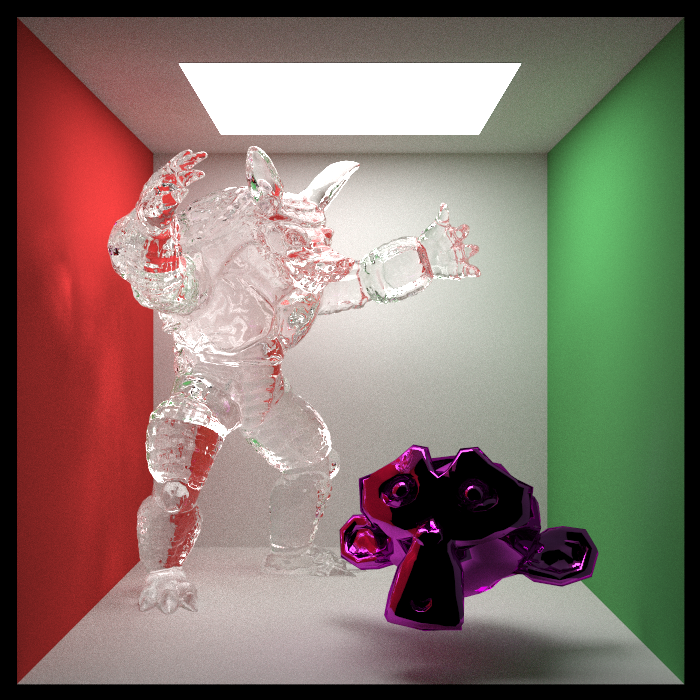
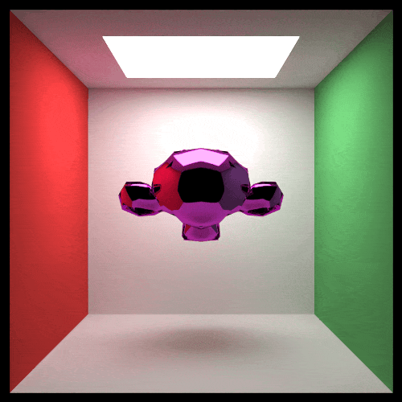
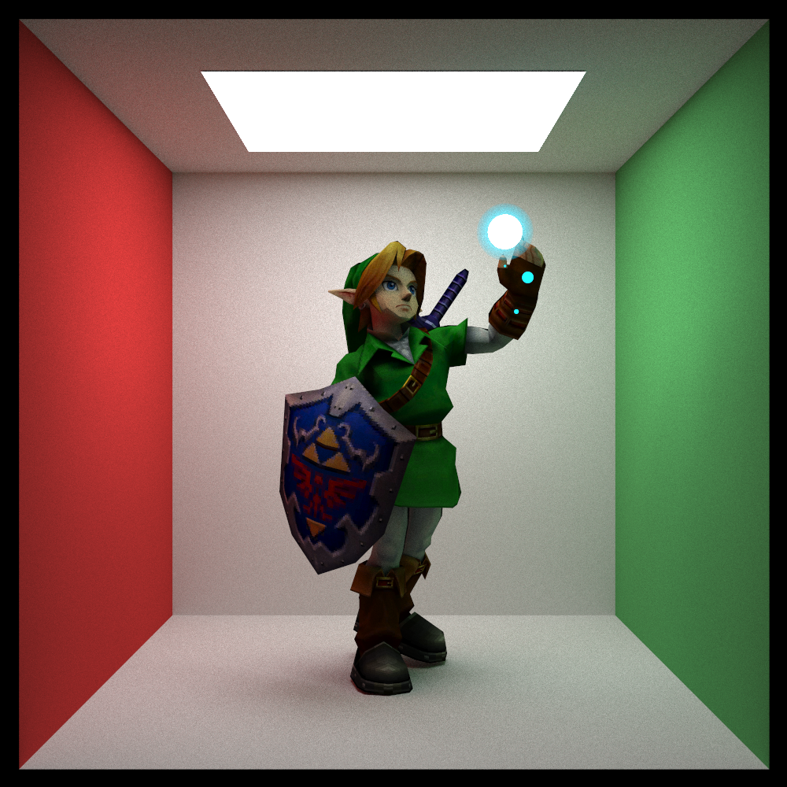
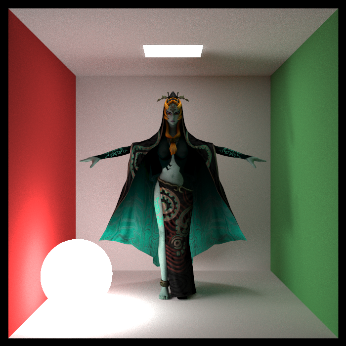
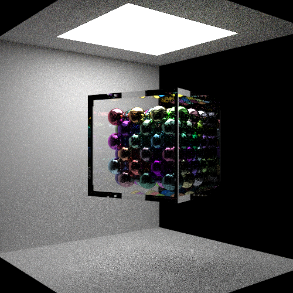
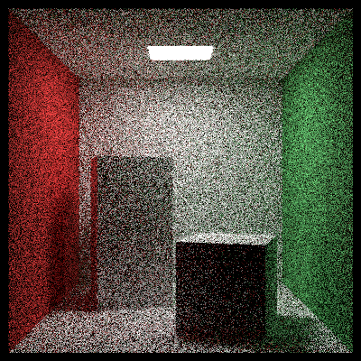
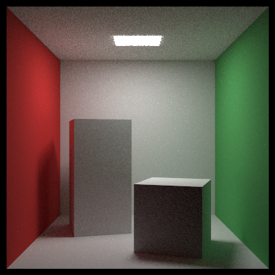
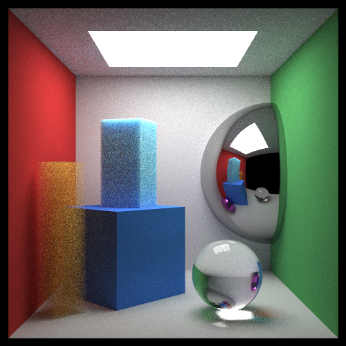
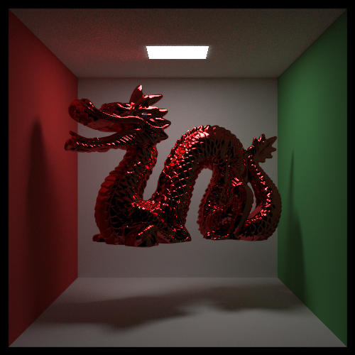

# Software Path Tracer

A C++ Monte Carlo path tracer that simulates physically-based light propagation to produce photorealistic renders.

<p align="center">
  <br/>
  <sub><b>Cornell Box</b> - 1000 SPP, 600x600</sub>
</p>

---

## Features

- **Physically-Based Materials**: Lambertian diffuse, specular metal with Schlick–Fresnel approximation, dielectric refraction (Snell's Law) with total internal reflection, constant medium volumetrics
- **BVH Acceleration**: Bounding Volume Hierarchy with AABB slab-method ray tests; reduces scene traversal from O(n) to O(log n)
- **Multithreading**: Parallel tile-based rendering via Intel TBB; ~4× speedup over sequential on a multi-core CPU
- **Optical Effects**: Depth-of-field (defocus disk sampling), motion blur (time-parameterized intersection), area lighting
- **Procedural Textures**: Perlin noise with trilinear interpolation, Hermite smoothing, and multi-octave turbulence
- **Image Textures**: UV-mapped JPG/PNG via stb_image library
- **Geometry**: Spheres, axis-aligned parallelograms, composite box primitive, triangle meshes
- **Triangle Meshes**: Barycentric intersection test; per-vertex normal interpolation for smooth shading; UV attribute interpolation
- **OBJ Loading**: Wavefront OBJ parser supporting all face formats (`v`, `v/vt`, `v//vn`, `v/vt/vn`), negative indices, and n-gon fan triangulation; BVH-accelerated mesh; auto-scale helper
- **Anti-aliasing**: Multi-sample per-pixel with random jitter
- **Image Denoising**: Intel Open Image Denoiser for improved render fidelity at lower samples

---

## Gallery

<table>
  <tr>
    <td align="center">
        <br/>
        <sub><b>Suzanne (OIDN Denoised)</b> - 100 SPP, 500x500</sub>
      </td>
    <td align="center">
      <br/>
      <sub><b>Randomized Sphere Cornell Box</b> - 2000 SPP, 600x600</sub>
    </td>
  </tr>
  <tr>
        </td>
    <td align="center">
    <br/>
      <sub><b>Link & Navi</b> - 1000 SPP, 500x500</sub>
    </td>
    <td align="center">
    <br/>
      <sub><b>Midna</b> - 500 SPP, 500x500</sub>
    </td>
  </tr>
  <tr>
      <td align="center">
        <br/>
        <sub><b>Ball-filled Glass Cube</b> - 2000 SPP, 600x600</sub>
      </td>
    <td align="center">
      <br/>
      <sub><b>Earth, Moon & Mars</b> - Spherical UV mapping with texture data. 100 SPP, 1600x900</sub>
    </td>
    </tr>
    </table>

---

## Performance

<table>
  <tr align="center">
    <td align="center">
      <br/>
      <sub><b>Ball-filled Glass Cube</b> - 100 SPP, 500x500</sub>
    </td>
  </tr>
</table>

Benchmarks on the Ball-filled Glass Cube scene (500×500, 100 SPP, max depth 50). Multithreading uses Intel TBB for tile-based parallelism. BVH uses axis-aligned bounding boxes with recursive subdivision.

| Configuration | Render Time | Speedup |
|---|---|---|
| Single-threaded, no BVH | 3m 28s | 1.0× (baseline) |
| Single-threaded, with BVH | 44.6s | 4.67× |
| Multi-threaded (TBB), with BVH | 7.6s | **27.4×** |

The BVH gives a **4.67× speedup** on a single thread by reducing ray-primitive intersection tests from `O(N)` to `O(log N)`. Adding tile-based parallelism on top yields an additional **5.86×**, for a combined **27.4× speedup** over the unoptimized baseline.

BVH speedups were most significant on scenes with many objects. Scenes with fewer objects actually saw slowdowns due to BVH-creation overhead.

---

### Direct Light Sampling (Next Event Estimation)

For every ray hit on a diffuse surface, a light source is directly sampled. This means for each ray hit, we check the path from that point to a randomly chosen light source and determine if that path is occluded. If it isn't, we compute the direct illumination contribution for that point. 

This results in far fewer samples per pixel being required to converge on the true illumination of a scene. Instead of relying on scattered rays to randomly hit a small light source, every diffuse bounce now explicitly evaluates direct illumination. A comparison of each method at 100 samples per pixel can be seen below.

<table>
  <tr>
    <td align="center">
      <br/>
      <sub><b>Naive Sampling</b> - 100 SPP, 400x400</sub>
    </td>
    <td align="center">
      <br/>
      <sub><b>Direct Light Sampling</b> - 100 SPP, 400x400</sub>
    </td>
  </tr>
</table>

---

### Volumes Update

Volumes were initially excluded from next event estimation. Extending the framework to handle the isotropic phase function (`1/(4π)`, uniform over the sphere) alongside the existing Lambertian term (`cos(θ)/π`) produced a significant noise reduction at equal sample counts.

<table>
  <tr>
    <td align="center">
      <br/>
      <sub><b>Naive Sampling</b> - 200 SPP, 500x500</sub>
    </td>
    <td align="center">
      <br/>
      <sub><b>Direct Light Sampling</b> - 200 SPP, 500x500</sub>
    </td>
  </tr>
</table>

---

### Triangle Mesh Rendering + OBJ Support

Triangles reuse `quad`'s plane–ray intersection. `quad` finds the `t` value where a ray hits the plane and computes barycentric-like coordinates (α, β) such that the hit point = Q + α·**u** + β·**v**. A quad's interior test is `0 ≤ α ≤ 1` and `0 ≤ β ≤ 1`. `triangle` overrides only that test: `α ≥ 0`, `β ≥ 0`, `α + β ≤ 1`, restricting the hit region to the half of the parallelogram below the hypotenuse. All plane intersection math, normal setup, and AABB construction are inherited unchanged.

**Smooth shading.** OBJ files supply per-vertex normals (`vn`). Instead of using the face's flat geometric normal, the three vertex normals are interpolated at the hit point using the same α, β coordinates:

```
N_interp = normalize((1 − α − β)·N₀  +  α·N₁  +  β·N₂)
```

This gives smooth curvature across a mesh without increasing triangle count, the same idea as Phong shading in rasterization, applied here during ray–surface evaluation. UV texture coordinates (`vt`) are interpolated identically.

**OBJ loading pipeline.** The parser handles all four Wavefront face token formats (`v`, `v/vt`, `v//vn`, `v/vt/vn`), relative (negative) indices, and fan-triangulates n-gons. The resulting triangle list is immediately wrapped in a `bvh_node`, so a mesh with hundreds of thousands of faces benefits from O(log n) ray traversal internally, independent of the scene-level BVH. A `load_obj_fit` helper auto-scales the mesh so its longest axis fits a target world-space size, solving the problem that OBJ files have no standard unit.

<table>
  <tr>
    <td align="center">
    <br/>
      <sub><b>Stanford Dragon</b> - 1000 SPP, 500x500</sub>

  </tr>

</table>


## Build

**Dependencies:** CMake ≥ 3.10, C++17 compiler, Intel TBB

```bash
cmake -B build
cmake --build build
```

## Usage

```bash
./build/raytracing [-s scene] [-w width] [--spp N] [-d depth] [--list]
```

| Flag | Description | Default |
|---|---|---|
| `-s`, `--scene` | Scene to render | `cornell_random` |
| `-w`, `--width` | Image width in pixels | `100` |
| `--spp` | Samples per pixel | `100` |
| `-d`, `--depth` | Max ray bounce depth | `30` |
| `--single-thread` | Disable TBB parallelism (useful for benchmarking and debugging) | multi-threaded |
| `--list` | List available scenes | — |


**Available scenes:** `space`, `scene2`, `cube_room`, `perlin_spheres`, `light_testing`, `cornell_box`, `cornell_random`, `cornell_variety`, `obj_mesh`

**Example:**
```bash
./build/raytracing -s cornell_box -w 500 --spp 1000 -d 50
```

All renders are placed in the `renders/` folder with timestamps and samples per pixel appended to filenames.

---


## References

- Peter Shirley, Trevor David Black, Steve Hollasch — [*Ray Tracing in One Weekend*](https://raytracing.github.io/books/RayTracingInOneWeekend.html)
- Peter Shirley, Trevor David Black, Steve Hollasch — [*Ray Tracing: The Next Week*](https://raytracing.github.io/books/RayTracingTheNextWeek.html)
