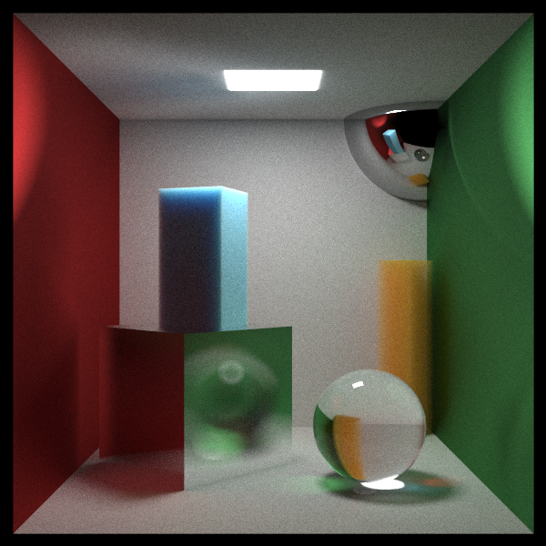
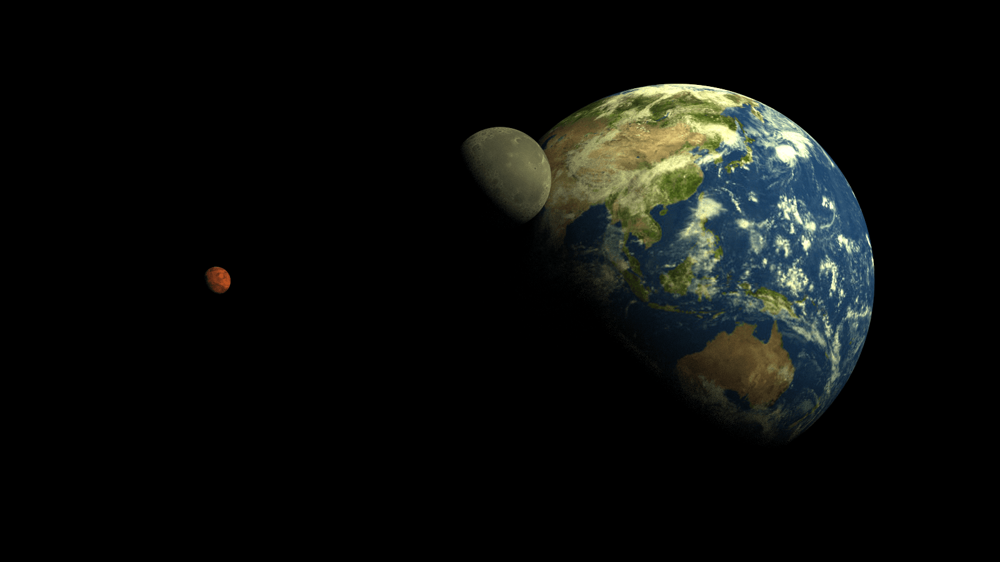
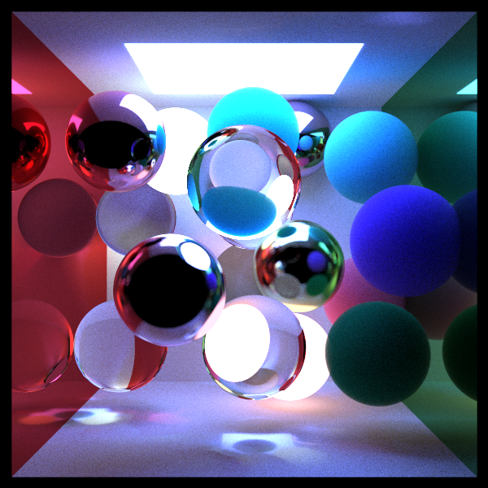

# Software Path Tracer

A C++ Monte Carlo path tracer that simulates physically-based light propagation to produce photorealistic renders.

<p align="center">
  <br/>
  <sub><b>Cornell Box</b> - 7000 SPP, 600x600</sub>
</p>

---

## Features

- **Physically-Based Materials**: Lambertian diffuse, specular metal with Schlick–Fresnel approximation, dielectric refraction (Snell's Law) with total internal reflection, constant medium volumetrics
- **BVH Acceleration**: Bounding Volume Hierarchy with AABB slab-method ray tests; reduces scene traversal from O(n) to O(log n)
- **Multithreading**: Parallel tile-based rendering via Intel TBB; ~4× speedup over sequential on a multi-core CPU
- **Optical Effects**: Depth-of-field (defocus disk sampling), motion blur (time-parameterized intersection), area lighting
- **Procedural Textures**: Perlin noise with trilinear interpolation, Hermite smoothing, and multi-octave turbulence
- **Image Textures**: UV-mapped JPG/PNG via stb_image library
- **Geometry**: Spheres, axis-aligned parallelograms, composite box primitive
- **Anti-aliasing**: Multi-sample per-pixel with random jitter

---

## Gallery

<table>
  <tr>
    <td align="center">
      <br/>
      <sub><b>Earth, Moon & Mars</b> - Spherical UV mapping with texture data. 10000 SPP, 1600x900</sub>
    </td>
  </tr>
  <tr>
    <td align="center">
      <br/>
      <sub><b>Randomized Sphere Cornell Box</b> - 3000 SPP, 500x500</sub>
    </td>
  </tr>
</table>

---

## Performance

Benchmarks on the Cornell Box scene (400×400, 1000 SPP). Multithreading uses Intel TBB for tile-based parallelism.

| Configuration | Render Time |
|---|---|
| Single-threaded | 4m 46s |
| Multi-threaded (TBB) | 1m 16s |

**~3.75× speedup** from multithreading.

---

## Build

**Dependencies:** CMake ≥ 3.10, C++17 compiler, Intel TBB

```bash
cmake -B build
cmake --build build
./build/raytracing
```

All renders are placed in the renders folder with timestamps and samples per pixel appended to filenames.

---

## References

- Peter Shirley, Trevor David Black, Steve Hollasch — [*Ray Tracing in One Weekend*](https://raytracing.github.io/books/RayTracingInOneWeekend.html)
- Peter Shirley, Trevor David Black, Steve Hollasch — [*Ray Tracing: The Next Week*](https://raytracing.github.io/books/RayTracingTheNextWeek.html)
